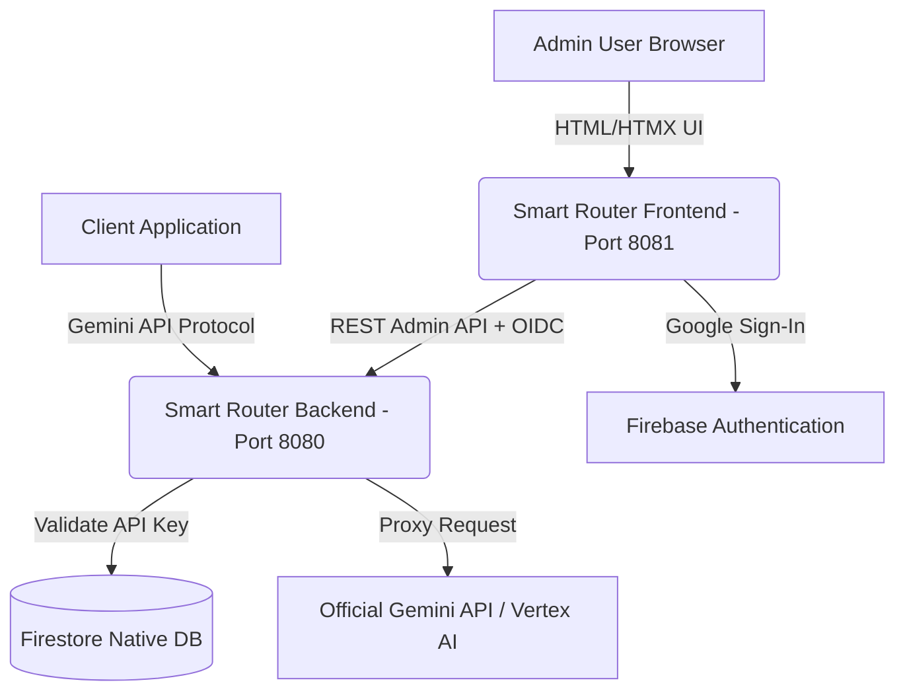

# 🌌 Smart Router

[](https://go.dev)
[](https://www.terraform.io/)
[](https://cloud.google.com/)
[](https://firebase.google.com/)

A high-performance, cost-effective, and extremely durable **Gemini-compliant API Router** designed for seamless deployment on **Google Cloud Run**. Featuring live API key management, smart request routing, detailed usage metrics, and an elegant HTMX-powered administrative dashboard protected securely by Firebase-backed Google Sign-In.

---

## 🗺️ Architecture Overview

The Smart Router acts as a drop-in proxy replacement for your Gemini API requests, giving you granular control over cost, access, and observability.



---

## ⚙️ Quick Start Prerequisites

Ensure you have the following developer toolsets installed locally:

* **Go** (version 1.22 or higher)
* **Google Cloud SDK** (`gcloud` CLI)
* **Terraform**
* **jq** (for automated shell parsing)
* **templ** (Go HTML component compiler)

---

## 🔑 Local Configuration & Credentials Setup

To configure your local development environment and get the necessary keys, copy the environment template:

```bash
cp .env.sample .env
```

### How to Populate `.env`

Your `.env` configuration requires Google Cloud and Firebase integration values:

```ini
PORT=8080
GOOGLE_CLOUD_PROJECT="your-gcp-project-id"
GEMINI_API_KEY="AIzaSyYourOfficialGoogleGeminiAPIKey"

# Firebase Client Web SDK Configurations (For Admin Login)
FIREBASE_API_KEY="AIzaSyYourFirebaseWebApiKey"
FIREBASE_AUTH_DOMAIN="your-project-id.firebaseapp.com"
FIREBASE_PROJECT_ID="your-gcp-project-id"
FIREBASE_STORAGE_BUCKET="your-project-id.appspot.com"
FIREBASE_MESSAGING_SENDER_ID="123456789"
FIREBASE_APP_ID="1:1234:web:abcd"
```

> [!TIP]
> **You do not need to manually search for Firebase Web SDK configurations!** Our automated `deploy.sh` script automatically hooks into the Google Cloud and Firebase Management REST APIs to verify, enable, register, and write all of these values directly into your `.env` file automatically.

---

## 🚀 Cloud Deployment (New & Existing GCP Projects)

Deploying the Smart Router to Google Cloud is automated via a robust combination of **Terraform** (for infrastructure) and a single-command **deployment pipeline wrapper (`deploy.sh`)** (for automated Firebase Web SDK registration, templ rendering, container builds, and system deployments).

### 📋 New Google Cloud Project: Manual Pre-requisites

If you are deploying the Smart Router to a **brand new Google Cloud Project**, there are a few one-time manual steps you must perform in the Google Cloud Console first:

1. **Enable Billing (Mandatory)**:
   - Associate an active **Billing Account** with your Google Cloud project. The deployment provisions serverless containers (Cloud Run), Secret Manager secrets, a native Firestore Database, Cloud Build triggers, and Google Identity Platform, which are only accessible on billing-enabled projects.
2. **Configure OAuth Consent Screen (Mandatory for Google Sign-In)**:
   - Navigate to the [Google Cloud Console](https://console.cloud.google.com/).
   - Go to **APIs & Services > OAuth consent screen**.
   - Select a **User Type**:
     - **Internal** (Recommended if deploying for your organization/team, restricting login strictly to your domain members).
     - **External** (If you want to authorize any individual Google email address to access).
   - Fill out the required fields: **App name** (e.g. `Smart Router Admin`), **User support email**, and **Developer contact information**. Click **Save and Continue**.
3. **Enable Google Sign-In Provider in Identity Platform (Mandatory)**:
   - Search for **Identity Platform** in the GCP search bar (this is the underlying engine for Firebase Auth).
   - Go to **Providers** in the left-hand menu.
   - Click **Add Provider** and select **Google**.
   - Toggle the **Enabled** switch.
   - Select your project's **Support email** in the dropdown, and click **Save**.

### 1. Authenticate `gcloud` Locally

Ensure your local terminal context is authenticated and set to your target GCP project:

```bash
# 1. Authenticate standard gcloud CLI
gcloud auth login

# 2. Configure active CLI project context
gcloud config set project your-gcp-project-id

# 3. Authorize Application Default Credentials (ADC)
# (This enables Terraform and the deploy script to act programmatically on your behalf)
gcloud auth application-default login
gcloud auth application-default set-quota-project your-gcp-project-id
```

### 2. (Optional) Set Authorized Domains & Specific Email Addresses

By default, admin dashboard logins are restricted to email addresses ending in `@google.com` and `@cloudadvocacyorg.joonix.net` to prevent unauthorized console access.

To authorize your own domain suffixes or individual email addresses (e.g., a specific team email alongside whole company domains):
1. Open `.env` (copied from `.env.sample`).
2. Add or update the `ALLOWED_EMAIL_DOMAINS` variable with a comma-separated list of domains and/or specific emails:
   ```ini
   # Supports both whole domains (e.g. 'mycompany.com') and specific individual emails (e.g. 'operator@gmail.com') simultaneously:
   ALLOWED_EMAIL_DOMAINS="mycompany.com,operator@gmail.com,another-team.org"
   ```

### 3. Run the Deploy Script

Now, initiate the primary deployment pipeline:

```bash
chmod +x deploy.sh
./deploy.sh
```

### What the Automated Deploy Script Does:
1. **Baseline Environment Load:** Loads `.env` configurations and validates active variables.
2. **Firebase Integration Auto-Setup:**
   - Connects to Firebase REST endpoints using your active gcloud authentication context.
   - Checks if Firebase is enabled for the project. If not, automatically registers and links Firebase.
   - Checks for existing registered Web Applications. If none are found, automatically provisions a new Web Application named `Smart Router Admin`.
   - Extracts all Firebase Web SDK credentials and automatically writes them to `.env`—updating active shell instances.
3. **Infrastructure Provisioning (Terraform):**
   - Enables cloud services (`run`, `firestore`, `secretmanager`, `identitytoolkit`, `monitoring`).
   - Provisions Firestore Database in Native mode.
   - Sets up Secure IAM Policies, dynamic runners, and Secret Manager configurations.
4. **Key Storage Secure Upload:** Automatically syncs your developer `GEMINI_API_KEY` to Google Secret Manager if it doesn't exist.
5. **Go Component Compilation:** Runs `templ generate` to compile beautiful, compiled HTML components.
6. **Cloud Build & Run Deployment:** Packages the Go router container, pushes it to Google Artifact Registry, and spins up the Cloud Run microservice.
7. **Outputs Service URL:** Prints your live Gemini API Proxy Endpoint!

---

## 🔒 Manual Credentials & Console Provisioning

If you prefer to manual configure your Firebase credentials, or do not have direct command-line access:

1. Open the [Firebase Console](https://console.firebase.google.com/).
2. Click **Add Project** and select your existing Google Cloud Project.
3. In the Project Overview pane, click the **Web icon (</>)** to register a new application.
4. Enter `Smart Router Admin` as the nickname.
5. Copy the auto-generated `firebaseConfig` object values into your `.env` file.
6. Select **Build > Authentication** in the left-hand menu, enable the **Google** sign-in provider, and save.

---

## 🎛️ Local Development & Execution

To run the decoupled Smart Router services concurrently locally:

### 1. Install Go Dependencies
```bash
go mod download
```

### 2. Orchestrate Service Bootup
```bash
./run_local.sh
```

This orchestrator compiles UI Templ modules and boots both backend and frontend services:
* **Backend Proxy & REST API Service**: Launches on `http://localhost:8080` (direct proxy and config API callable).
* **Frontend Portal UI Service**: Launches on `http://localhost:8081` (access web interface at `http://localhost:8081/login`).

---

## 🧪 Compatibility Auditing & Verification

To ensure the Smart Router remains completely synchronized and compatible with both standard Gemini APIs and the **Gemini Enterprise Agent Platform** (Vertex AI Reasoning Engine / Agent Engine and RAG Engine), we provide an automated compatibility test suite and repeatable agent audit skills.

### 1. Running Automated Compatibility Tests
We provide in-memory, offline-compatible integration tests that simulate standard and enterprise API calls (mapping routing rules, rate limits, auth token injection, and path translation):
```bash
go test -v ./pkg/proxy/...
```

### 2. Continuous Audits
We provide a repeatable capability audit skill file at [skills/compatibility_audit.md](skills/compatibility_audit.md). Any AI coding agent (such as Antigravity) can load this file to execute structured regressions, verify active routes in `main.go`, and perform automated compatibility checks.

---

## 🔌 Deployed Client Examples & Integrations

We provide production-ready, fully containerized client service templates deployed on **Google Cloud Run** that demonstrate how to connect to and call the Smart Router using the most cost-effective model (`gemini-2.5-flash-lite`):

| Example | Type | Auth Protocol | Key Security | Best Use Case |
| :--- | :--- | :--- | :--- | :--- |
| **[API Key Integration](examples/cloudrun-apikey/)** | Microservice | HTTP Header (`x-goog-api-key`) | Static API Key in Env / Secrets | Traditional client apps, legacy services, external SaaS integrations. |
| **[Service Account IAM](examples/cloudrun-serviceaccount/)** | Microservice | Google OIDC Token (`Authorization: Bearer`) | Zero-Key IAM (Metadata Server) | Secure internal workloads, cloud native microservices, auditable audit trails. |

For complete guides on app registration, configuration limits, deployment scripts, and payload schemas, please refer directly to the respective template directories.

---

## 🛠️ Troubleshooting

### 1. `identitytoolkit` API Errors
If your deployment fails while provisioning Google Identity Platform, make sure that your Google Cloud billing is active and that the API is enabled in your console. You can manually enable it using:
```bash
gcloud services enable identitytoolkit.googleapis.com
```

### 2. Missing Firebase API Keys
If the script completes but says `FIREBASE_API_KEY` is missing, Firebase was likely enabled, but no browser API key was automatically generated. Go to your **GCP Console > APIs & Services > Credentials** and verify that an auto-created browser/web key exists.

### 3. Terraform State Drift
If you make updates to the Cloud Run service settings or active deployments, the script will ignore minor revisions to container images automatically. To tear down all provisioned infrastructure:
```bash
cd terraform && terraform destroy -var="project_id=$GOOGLE_CLOUD_PROJECT"
```
