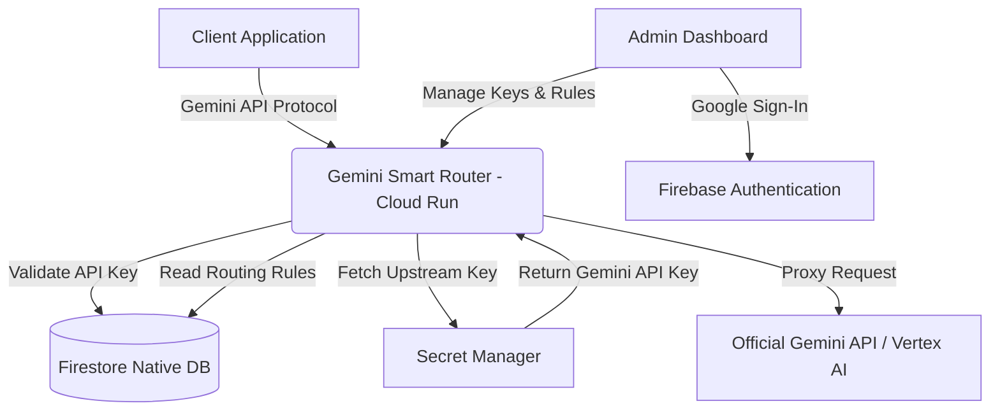

# 🌌 Gemini Smart Router

[](https://go.dev)
[](https://www.terraform.io/)
[](https://cloud.google.com/)
[](https://firebase.google.com/)

A high-performance, cost-effective, and extremely durable **Gemini-compliant API Router** designed for seamless deployment on **Google Cloud Run**. Featuring live API key management, smart request routing, detailed usage metrics, and an elegant HTMX-powered administrative dashboard protected securely by Firebase-backed Google Sign-In.

---

## 🗺️ Architecture Overview

The Gemini Smart Router acts as a drop-in proxy replacement for your Gemini API requests, giving you granular control over cost, access, and observability.



---

## ⚙️ Quick Start Prerequisites

Ensure you have the following developer toolsets installed locally:

* **Go** (version 1.22 or higher)
* **Google Cloud SDK** (`gcloud` CLI)
* **Terraform**
* **jq** (for automated shell parsing)
* **templ** (Go HTML component compiler)

---

## 🔑 Local Configuration & Credentials Setup

To configure your local development environment and get the necessary keys, copy the environment template:

```bash
cp .env.sample .env
```

### How to Populate `.env`

Your `.env` configuration requires Google Cloud and Firebase integration values:

```ini
PORT=8080
GOOGLE_CLOUD_PROJECT="your-gcp-project-id"
GEMINI_API_KEY="AIzaSyYourOfficialGoogleGeminiAPIKey"

# Firebase Client Web SDK Configurations (For Admin Login)
FIREBASE_API_KEY="AIzaSyYourFirebaseWebApiKey"
FIREBASE_AUTH_DOMAIN="your-project-id.firebaseapp.com"
FIREBASE_PROJECT_ID="your-gcp-project-id"
FIREBASE_STORAGE_BUCKET="your-project-id.appspot.com"
FIREBASE_MESSAGING_SENDER_ID="123456789"
FIREBASE_APP_ID="1:1234:web:abcd"
```

> [!TIP]
> **You do not need to manually search for Firebase Web SDK configurations!** Our automated `deploy.sh` script automatically hooks into the Google Cloud and Firebase Management REST APIs to verify, enable, register, and write all of these values directly into your `.env` file automatically.

---

## 🚀 Automated Cloud Deployment

Deploying to Google Cloud is fully automated. 

### 1. Authenticate `gcloud`

Before running the deployment script, make sure you are authenticated with Google Cloud and have set your target project:

```bash
# Login to gcloud CLI
gcloud auth login

# Configure your active CLI project context
gcloud config set project your-gcp-project-id

# Authorize Application Default Credentials (ADC) for Terraform & scripts
gcloud auth application-default login
gcloud auth application-default set-quota-project your-gcp-project-id
```

### 2. Run the Deploy Script

Execute the primary deployment pipeline:

```bash
chmod +x deploy.sh
./deploy.sh
```

### What the Automated Deploy Script Does:
1. **Baseline Environment Load:** Loads `.env` configurations and validates active variables.
2. **Firebase Integration Auto-Setup:**
   - Connects to Firebase REST endpoints using your active gcloud authentication context.
   - Checks if Firebase is enabled for the project. If not, automatically registers and links Firebase.
   - Checks for existing registered Web Applications. If none are found, automatically provisions a new Web Application named `Gemini Router Admin`.
   - Extracts all Firebase Web SDK credentials and automatically writes them to `.env`—updating active shell instances.
3. **Infrastructure Provisioning (Terraform):**
   - Enables cloud services (`run`, `firestore`, `secretmanager`, `identitytoolkit`, `monitoring`).
   - Provisions Firestore Database in Native mode.
   - Sets up Secure IAM Policies, dynamic runners, and Secret Manager configurations.
4. **Key Storage Secure Upload:** Automatically syncs your developer `GEMINI_API_KEY` to Google Secret Manager if it doesn't exist.
5. **Go Component Compilation:** Runs `templ generate` to compile beautiful, compiled HTML components.
6. **Cloud Build & Run Deployment:** Packages the Go router container, pushes it to Google Artifact Registry, and spins up the Cloud Run microservice.
7. **Outputs Service URL:** Prints your live Gemini API Proxy Endpoint!

---

## 🔒 Manual Credentials & Console Provisioning

If you prefer to manual configure your Firebase credentials, or do not have direct command-line access:

1. Open the [Firebase Console](https://console.firebase.google.com/).
2. Click **Add Project** and select your existing Google Cloud Project.
3. In the Project Overview pane, click the **Web icon (</>)** to register a new application.
4. Enter `Gemini Router Admin` as the nickname.
5. Copy the auto-generated `firebaseConfig` object values into your `.env` file.
6. Select **Build > Authentication** in the left-hand menu, enable the **Google** sign-in provider, and save.

---

## 🎛️ Local Development & Execution

To run the Gemini Smart Router locally:

### 1. Install Go Dependencies
```bash
go mod download
```

### 2. Generate Web Components
```bash
go run github.com/a-h/templ/cmd/templ generate
```

### 3. Run the Server
```bash
go run main.go
```

By default, the router will launch on `http://localhost:8080`. You can navigate to `http://localhost:8080/admin` to access the administration control panel.

---

## 🧪 Compatibility Auditing & Verification

To ensure the Gemini Smart Router remains completely synchronized and compatible with both standard Gemini APIs and the **Gemini Enterprise Agent Platform** (Vertex AI Reasoning Engine / Agent Engine and RAG Engine), we provide an automated compatibility test suite and repeatable agent audit skills.

### 1. Running Automated Compatibility Tests
We provide in-memory, offline-compatible integration tests that simulate standard and enterprise API calls (mapping routing rules, rate limits, auth token injection, and path translation):
```bash
go test -v ./pkg/proxy/...
```

### 2. Continuous Audits
We provide a repeatable capability audit skill file at [skills/compatibility_audit.md](skills/compatibility_audit.md). Any AI coding agent (such as Antigravity) can load this file to execute structured regressions, verify active routes in `main.go`, and perform automated compatibility checks.

---

## 🔌 Deployed Client Examples & Integrations

We provide production-ready, fully containerized client service templates deployed on **Google Cloud Run** that demonstrate how to connect to and call the Gemini Smart Router using the most cost-effective model (`gemini-2.5-flash-lite`):

| Example | Type | Auth Protocol | Key Security | Best Use Case |
| :--- | :--- | :--- | :--- | :--- |
| **[API Key Integration](examples/cloudrun-apikey/)** | Microservice | HTTP Header (`x-goog-api-key`) | Static API Key in Env / Secrets | Traditional client apps, legacy services, external SaaS integrations. |
| **[Service Account IAM](examples/cloudrun-serviceaccount/)** | Microservice | Google OIDC Token (`Authorization: Bearer`) | Zero-Key IAM (Metadata Server) | Secure internal workloads, cloud native microservices, auditable audit trails. |

For complete guides on app registration, configuration limits, deployment scripts, and payload schemas, please refer directly to the respective template directories.

---

## 🛠️ Troubleshooting

### 1. `identitytoolkit` API Errors
If your deployment fails while provisioning Google Identity Platform, make sure that your Google Cloud billing is active and that the API is enabled in your console. You can manually enable it using:
```bash
gcloud services enable identitytoolkit.googleapis.com
```

### 2. Missing Firebase API Keys
If the script completes but says `FIREBASE_API_KEY` is missing, Firebase was likely enabled, but no browser API key was automatically generated. Go to your **GCP Console > APIs & Services > Credentials** and verify that an auto-created browser/web key exists.

### 3. Terraform State Drift
If you make updates to the Cloud Run service settings or active deployments, the script will ignore minor revisions to container images automatically. To tear down all provisioned infrastructure:
```bash
cd terraform && terraform destroy -var="project_id=$GOOGLE_CLOUD_PROJECT"
```
