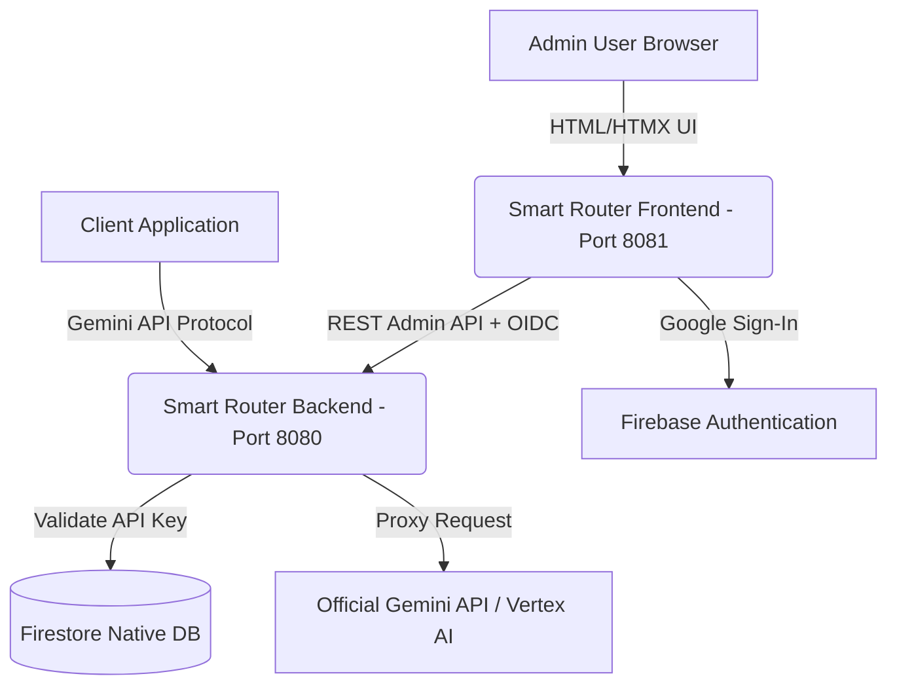

# 🌌 Smart Router

[](https://go.dev)
[](https://www.terraform.io/)
[](https://cloud.google.com/)
[](https://firebase.google.com/)

An API router for Gemini proxy requests, deployable on Google Cloud Run. It provides API key management, request routing, usage metrics, and an administrative dashboard with Firebase Google Sign-In.

---

## 🗺️ Architecture Overview

The Smart Router acts as a proxy for Gemini API requests, providing control over cost, access, and observability.



---

## ⚙️ Prerequisites

* **Go** (version 1.22 or higher)
* **Google Cloud SDK** (`gcloud` CLI)
* **Terraform**
* **jq**
* **templ** (Go HTML component compiler)

---

## 🔑 Local Configuration

1. Copy the environment template:
   ```bash
   cp .env.sample .env
   ```

2. Populate `.env`:
   * **Required User-Provided Variables**:
     ```ini
     PORT=8080
     GOOGLE_CLOUD_PROJECT="your-gcp-project-id"
     GEMINI_LOCATION="us-central1"
     ```
   * **Firebase Web SDK Configurations** (Keep default placeholders if planning to run automated deployment):
     ```ini
     FIREBASE_API_KEY="AIzaSyYourFirebaseWebApiKey"
     FIREBASE_AUTH_DOMAIN="your-project-id.firebaseapp.com"
     FIREBASE_PROJECT_ID="your-gcp-project-id"
     FIREBASE_STORAGE_BUCKET="your-project-id.appspot.com"
     FIREBASE_MESSAGING_SENDER_ID="123456789"
     FIREBASE_APP_ID="1:1234:web:abcd"
     ```

> [!TIP]
> **Don't fill out the Firebase configuration fields manually!** 
> Running the automated `./deploy.sh` script will automatically link Firebase, register a Web App, fetch these configuration values, and write them directly back into your local `.env` file. You only need to configure them manually if you are running local-only developer setups without GCP access.


---

## 🚀 Cloud Deployment

### 1. Google Cloud Project Prerequisites
If deploying to a new Google Cloud project:
1. **Enable Billing**: Link your project to an active Billing Account.
2. **Configure OAuth Consent Screen**: Go to **APIs & Services > OAuth consent screen**, select user type, and fill out the required fields.
3. **Enable Google Sign-In**: Go to **Identity Platform > Providers**, add **Google** as a provider, and enable it.

### 2. Authenticate `gcloud` Locally
```bash
gcloud auth login
gcloud config set project your-gcp-project-id
gcloud auth application-default login
gcloud auth application-default set-quota-project your-gcp-project-id
```

### 3. Set Authorized Domains & Email Addresses
For security, there are no hardcoded default domains. You must explicitly set the allowed email domains or specific email addresses in your `.env` file before deployment:
```ini
ALLOWED_EMAIL_DOMAINS="yourcompany.com,operator@gmail.com"
```

### 4. Run the Deployment
```bash
chmod +x deploy.sh
./deploy.sh
```

#### What `deploy.sh` does:
1. Loads `.env` variables.
2. Programmatically checks and configures Firebase Web App registration.
3. Provisions infrastructure using Terraform (Cloud Run, Native Firestore, Secret Manager, Identity Toolkit).
4. Generates HTML templates using `templ`.
5. Builds and deploys the containers to Cloud Run.
6. Runs post-deployment verification tests.

---

## 🔒 Manual Credentials & Console Provisioning

To manually configure Firebase credentials:
1. Open the [Firebase Console](https://console.firebase.google.com/) and select your Google Cloud Project.
2. Register a new Web Application named `Smart Router Admin`.
3. Copy the config values into `.env`.
4. In **Authentication > Sign-in method**, enable the **Google** provider.

---

## 🎛️ Local Development

1. Download Go dependencies:
   ```bash
   go mod download
   ```

2. Start the services:
   ```bash
   ./run_local.sh
   ```
   * Backend: `http://localhost:8080`
   * Frontend Portal: `http://localhost:8081/login`

---

## 🧪 Testing & Verification

Run integration and unit tests:
```bash
go test -v ./backend/proxy/... ./frontend/dashboard/...
```

---

## 🔌 Deployed Client Examples

* **[Google GenAI SDK Coverage & Integration](docs/architecture/google-genai-sdk-coverage.md)**: Compatibility matrix, integration instructions, and key coverage gaps for the official `google-genai` SDKs.
* **[API Key Integration](examples/cloudrun-apikey/)**: Client using HTTP Header (`x-goog-api-key`) authentication.
* **[Service Account IAM](examples/cloudrun-serviceaccount/)**: Client using OIDC Token (`Authorization: Bearer`) authentication.
