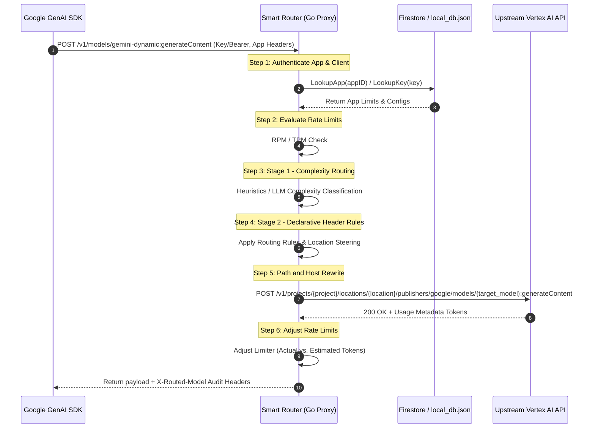

# 🗺️ Google GenAI SDK Coverage vs. Smart Router Capabilities

This document provides a comprehensive technical matrix comparing the capabilities of the official **Google GenAI SDK** (`google-genai` in Python, Node.js, etc.) against the native processing, interception, and routing capabilities of the **Smart Router**.

---

## 📊 Compatibility Matrix

The table below outlines how SDK calls map to the Smart Router, including support status, telemetry/rate-limiting support, and known integration caveats.

| SDK Namespace / Feature | Go Proxy API Endpoint | Status | Rate Limiting (RPM/TPM) | Complexity Routing (`gemini-dynamic`) | Technical Details & Caveats |
| :--- | :--- | :--- | :--- | :--- | :--- |
| **`models.generate_content`** | `POST /v1/models/*:generateContent` | **Full** | Yes (Full adjustment) | Yes | Intercepted, token counts adjusted in post-request `ModifyResponse` callback. |
| **`models.generate_content_stream`** | `POST /v1/models/*:streamGenerateContent` | **Full** | Yes (Base limit) | Yes | Request/response streams successfully. **Caveat:** Real-time token counting is bypassed; falls back to input character heuristics. |
| **Structured Outputs** | Inside `generateContent` payload | **Full** | Yes | Yes | Fully supported as the `responseSchema` is passed transparently to the Vertex AI endpoint. |
| **Function Calling & Tools** | Inside `generateContent` payload | **Full** | Yes | Yes | Intercepted. If `ForceComplexTools` is enabled, routes automatically to `gemini-2.5-pro`. |
| **Multimodal (Images/Files)** | Inside `generateContent` payload | **Full** | Yes | Yes | Supported. If `ForceComplexMultimodal` is enabled, instantly bypasses LLM classifier and routes to `gemini-2.5-pro`. |
| **System Instructions** | Inside `generateContent` payload | **Full** | Yes | Yes | Supported. Passed transparently upstream. |
| **`models.embed_content`** | `POST /v1/models/*:embedContent` | **Partial** | RPM Only | No | **Caveat:** TPM estimation `/ 4` is optimized for generation; embeddings bypass semantic token adjustments. |
| **`models.count_tokens`** | `POST /v1/models/*:countTokens` | **Full** | RPM Only | No | Rewritten to regional endpoint. Bypasses TPM limitations since no content is generated. |
| **`chats` (Sessions)** | Uses `generateContent` loop | **Full** | Yes | Yes | Standard SDK chat sessions use standard generate content methods under the hood. |
| **`files.upload` (File API)** | `POST /v1beta/files` (or Vertex equivalent) | **Unsupported** | No | No | **Gap:** Large file staging APIs target different host/paths. Clients must upload large files (>20MB) directly to Vertex AI/GCP buckets. |
| **`models.list` / `models.get`** | `GET /v1/models` | **Unsupported** | No | No | **Gap:** List models query paths bypass regional prefix rules. Use the Smart Router Admin dashboard to view registered active models. |
| **`caches` (Context Caching)** | `POST /v1/cachedContents` | **Unsupported** | No | No | **Gap:** Context caching endpoints are not currently intercepted or rewritten by the Go router's reverse proxy director. |

---

## 🧠 Core Architectural Interception Flow

The Smart Router intercepts standard HTTP client traffic generated by the Google GenAI SDK by overriding the target host and regional URL paths.



---

## 🛠️ Integration Guide

To configure the official Google GenAI SDK to target the Smart Router, override the `api_endpoint` inside the client options block.

### Python SDK Example

```python
from google import genai
from google.genai import types

# Initialize client pointing to the Smart Router proxy
client = genai.Client(
    api_key="YOUR_ROUTER_API_KEY",
    http_options={
        "api_endpoint": "https://smartrouter.yourcompany.com"
    }
)

# Route dynamically based on payload size and complexity
response = client.models.generate_content(
    model="gemini-dynamic",
    contents="Explain Quantum Computing in one simple sentence.",
    config=types.GenerateContentConfig(
        http_headers={
            "X-Client-App-ID": "billing-service-prod"
        }
    )
)

print(f"Routed Model: {response.headers.get('X-Routed-Model')}")
print(f"Response: {response.text}")
```

### Node.js SDK Example

```javascript
import { GoogleGenAI } from '@google/genai';

const ai = new GoogleGenAI({
  apiKey: 'YOUR_ROUTER_API_KEY',
  httpOptions: {
    apiEndpoint: 'https://smartrouter.yourcompany.com'
  }
});

const response = await ai.models.generateContent({
  model: 'gemini-dynamic',
  contents: 'Write a simple hello world program in Rust.',
  config: {
    httpHeaders: {
      'X-Client-App-ID': 'billing-service-prod'
    }
  }
});

console.log(response.text);
```

---

## ⚠️ What is NOT Covered (Coverage Gaps & Limitations)

> [!WARNING]
> **CRITICAL COMPATIBILITY LIMITATIONS**:
> The Smart Router acts as a reverse proxy designed specifically to handle core text generation and regional endpoint rewriting. It is **NOT** a drop-in replacement for all Google GenAI endpoints. The following namespaces and features are completely unsupported or partially bypassed:

### 🔴 Completely Unsupported SDK Namespaces
* **`files` Namespace (`client.files.upload`, `client.files.get`, etc.)**:
  * **Reason**: The SDK's File API uploads large files directly to `https://generativelanguage.googleapis.com/upload/v1beta/files` or specific global cloud storage systems, bypassing regional `/v1/models` path rewrites.
  * **Mitigation**: Stage files directly in Google Cloud Storage (GCS) buckets and pass reference URIs using `fileData` inside the content request body, or bypass the router for standard file management calls.
* **`caches` Namespace (`client.caches.create`, `client.caches.list`, etc.)**:
  * **Reason**: Standard regional path-rewriter rules in `proxy.go` do not capture or translate the `/v1/cachedContents` path structure.
  * **Mitigation**: Call Vertex AI caching endpoints directly with native credentials rather than using the Smart Router proxy.
* **`tunings` Namespace (`client.tunings.create_tuned_model`)**:
  * **Reason**: Supervised fine-tuning and dataset pipeline actions utilize long-running operations on globally orchestrated resources that the proxy does not support.

### 🟡 Partially Supported / Caveated Features
* **Real-Time Streaming Token Tracking (`models.generate_content_stream`)**:
  * **Limit**: When using streaming chunks, the Smart Router cannot run post-request correction loops on response tokens inside `ModifyResponse` because the payload is written immediately to the TCP socket chunk-by-chunk.
  * **Mitigation**: The proxy defaults to a character count heuristic estimation (`len(bodyBytes) / 4`). Increase your App's TPM limits or select `OptOutTPM` for heavy streaming consumers to prevent false-positive rate limiting.
* **Dynamic Model Discovery (`models.list`, `models.get`)**:
  * **Limit**: SDK requests targeting `/v1/models` without concrete regional namespaces or actions fail path-matching validations, causing routing errors.
  * **Mitigation**: Avoid using programmatic SDK discovery methods. Instead, query the Smart Router dashboard UI at `/admin/models` to review verified active locations and compliant model versions.
* **Dynamic Embedding Routing & TPM Metrics (`models.embed_content`)**:
  * **Limit**: The TPM estimator formula is specifically calibrated for text generation. Embeddings are proxied to the correct regional server but bypass token rate calculations and dynamic routing optimizations.

