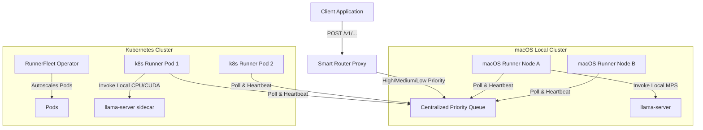
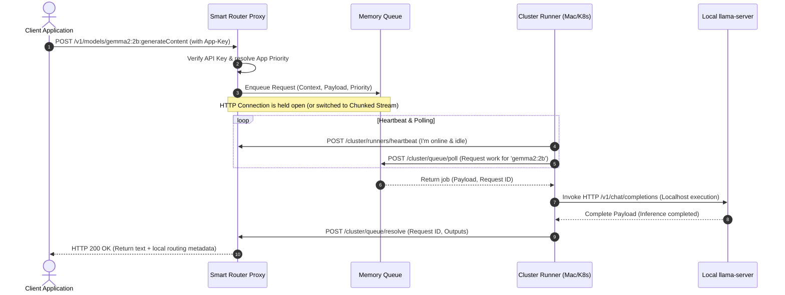

# 🏗️ Local Clusters Architecture & Implementation Plan

This plan outlines the design and roadmap for introducing **Local Clusters** to the Smart Router. A Local Cluster is a dynamic grouping of physical machines or cloud instances running dedicated serving runners (on macOS or Kubernetes) that register serving capacity, subscribe to a centralized Smart Router queue, and execute inference workloads locally.

---

## 📌 1. Architectural Overview

To scale hybrid AI workloads, the Smart Router coordinates requests across public APIs (Google Vertex AI, AWS, Azure) and local/on-prem servers. 



### Core Concept
1. **Dynamic Registration**: Computational nodes run standard Smart Router runners that heartbeat and register capabilities (RAM, GPUs, supported models).
2. **Centralized Queuing**: Rather than the Smart Router proactively pushing requests to edge devices (which may have dynamic IPs or exist behind firewalls), **runners poll the Smart Router's queue for work** using a pull model.
3. **Priority & Fairness**: The queue respects the App-level priority weights and SLAs (High, Medium, Low), feeding high-priority apps first while maintaining FIFO ordering per tier to prevent starvation.

---

## 📥 2. Smart Router Queuing & Control Plane

The central Smart Router backend acts as the control plane and queue orchestrator.

### Data Models (Aligned with `pkg/config/config.go`)
* **`LocalCluster`**: Defines queue configuration, time-to-live constraints (`MaxQueueAge`), and registers connected active `Runners`.
* **`Node`**: Tracks the state of individual runner nodes (`online`, `busy`, `offline`), hardware resources (GPUs, RAM), supported model lists, and heartbeats.
* **`QueueSnapshotItem`**: Represents requests awaiting execution, storing app contexts, timestamps, and priorities.

### Control Plane Endpoints (REST/Websockets)
The Smart Router backend exposes a lightweight internal protocol for runners:
* **`POST /api/v1/cluster/runners/register`**: Registers a new runner with capacity and capabilities.
* **`POST /api/v1/cluster/runners/heartbeat`**: Keeps the runner active and updates its availability status.
* **`POST /api/v1/cluster/queue/poll`**: Executed by runners to pull the next eligible job from the queue.
* **`POST /api/v1/cluster/queue/resolve`**: Delivers the generated text/token output back to the router, satisfying the pending client request.

---

## 🍏 3. macOS Runner (`smartrouter-runner-mac`)

Tailored for local desktop machines, developer workstations, and M-series Mac Minis/Studios.

### Architectural Highlights
* **Apple Silicon Optimization**: Integrates directly with **Metal Performance Shaders (MPS)** and unified memory architectures via `llama-server`.
* **Local Runner Compatibility**: Launches and communicates with a local `llama-server` instance over localhost REST APIs.
* **Process Isolation**: Runs as a background daemon (`launchd` plist configuration) requiring zero root permissions.

### Dynamic Resource Discovery
The macOS runner automatically profiles the host upon startup:
* **Memory Allocation**: Checks available unified system memory using `sysctl hw.memsize`.
* **Compute Power**: Detects active M-series cores (e.g., M1/M2/M3 Max/Ultra) and GPU execution pipelines.
* **Dynamic Support Registry**: Checks the local `llama-server` model registry to dynamically populate its `supported_models` array during heartbeat.

---

## ☸️ 4. Kubernetes Runner & Fleet (`smartrouter-runner-k8s`)

Tailored for enterprise scale, distributed server rooms, and cloud Kubernetes environments.

### Fleet Orchestration Design
* **K8s Operator / Deployment Model**: Deployed either as a `RunnerFleet` Custom Resource or standard `Deployment` where each pod acts as an independent computing node.
* **High Performance Inference Engines**: Pods leverage highly optimized backends like **llama-server** in a sidecar container.
* **Hardware Offloading**: Requests specific Nvidia device plugins (`nvidia.com/gpu`) or AMD ROCm mappings, with complete graceful fallbacks to statically compiled CPU-only binaries when running on cost-saver CPU pools.

### Intelligent Autoscaling via KEDA
To prevent resource waste, the Kubernetes fleet uses **KEDA (Kubernetes Event-driven Autoscaling)** to scale the number of active runner pods dynamically based on the queue depth exposed by the Smart Router metrics endpoint:

```yaml
apiVersion: keda.sh/v1alpha1
kind: ScaledObject
metadata:
  name: smartrouter-runner-scaler
spec:
  scaleTargetRef:
    apiVersion: apps/v1
    kind: Deployment
    name: smartrouter-runner-gke-spot
  minReplicaCount: 1
  maxReplicaCount: 20
  triggers:
  - type: prometheus
    metadata:
      serverAddress: http://smartrouter-metrics.default.svc:9090
      metricName: smartrouter_queue_depth
      query: sum(smartrouter_queue_depth{cluster_id="cluster-alpha"})
      threshold: '5'
```

---

## 🔄 5. End-to-End Interaction Lifecycle

The sequence diagram below shows how a user request is proxied, queued, executed, and returned.



---

## 🛠️ 6. Detailed Handoff Roadmaps for Future Sessions

### 📅 Session 1: Central Priority Queue & Control Plane REST APIs


* [x] **Step 1.1: Extend `pkg/config/config.go` with Cluster Runtime Structures**
    *   Define a `QueueJob` struct representing an active held request.
* [x] **Step 1.2: Implement Thread-Safe Priority Queues in `pkg/proxy/`**
    *   Create a queue structure managing a thread-safe sorted slice or bucketed lists (High, Medium, Low).
* [x] **Step 1.3: Implement Control Plane Route Handlers**
    *   Create `POST /api/v1/cluster/runners/register` (Runner dynamic capabilities registration).
    *   Create `POST /api/v1/cluster/runners/heartbeat` (Dynamic state: tracks last active timestamp).
    *   Create `POST /api/v1/cluster/queue/poll` (Called by runners to fetch the next eligible high-priority job).
    *   Create `POST /api/v1/cluster/queue/resolve` (Satisfies held request, unblocking `ResponseChan`).
* [x] **Step 1.4: Write Failing TDD Integration Tests in `pkg/proxy/proxy_test.go`**
    *   Verify that calling the proxy with a request routed to a local cluster blocks and enqueues.

---

### 📅 Session 2: macOS Runner (`smartrouter-runner-mac`) Implementation
**Objective:** Build the native standalone Go executable that runs on macOS, profiles Metal/unified memory hardware resources, polls the Smart Router queue, and executes local inference against llama-server.

* [x] **Step 2.1: Native Hardware Profiling Module**
    *   Create `cmd/runner/profile.go` to fetch Apple Silicon / Intel macOS system specifications.
* [x] **Step 2.2: Dynamic Model Discovery Integration**
    *   Poll local `llama-server` API to retrieve standard models. Map these directly to the `SupportedModels` string array.
* [x] **Step 2.3: Polling & Local Executor Client**
    *   Build an infinite HTTP polling loop that calls `/api/v1/cluster/queue/poll`.
    *   On job arrival: Translate payload to llama-server completions schema, execute locally, capture token metadata, and post to `/api/v1/cluster/queue/resolve`.

---

### 📅 Session 3: Kubernetes Runner & Fleet Orchestration
**Objective:** Build the Dockerized container workspace, configure high-throughput serving sidecars (`llama-server`), and design dynamic autoscaling with KEDA.

```
+------------------------------------------------------------------+
| Kubernetes Cluster Node                                          |
|  +------------------------+              +--------------------+  |
|  | Pod: runner-gke-spot   |              | Sidecar: llama-cpp |  |
|  |  - Polls SmartRouter   | -----------> |  - CPU/CUDA        |  |
|  |  - Resolves Queue      |              |  - Port 8080       |  |
|  +------------------------+              +--------------------+  |
+------------------------------------------------------------------+
```

* [x] **Step 3.1: High-Throughput Container Pipeline**
    *   Write `Dockerfile.runner` leveraging a lightweight Alpine multi-stage build to bundle the Go polling runner.
* [x] **Step 3.2: Multi-Container Pod Architecture**
    *   Create GKE deployers combining the poller runner and a CPU/CUDA optimized `llama-server` sidecar container. Configure shared network volumes for model caching.
* [x] **Step 3.3: Configure Kubernetes Hardware Passthrough**
    *   Provide full support for discrete GPU requests alongside robust fallback to statically compiled CPU-only releases.

---

### 📅 Session 4: UI Dashboard, Runner Pooling, & Resource Calculations
**Objective:** Update the Smart Router admin portal with screens for registered runners, cluster attachments, resource max limits tables, and real-time execution metrics.

#### 🖥️ 4.1 Screen A: "Registered Runners" Management Portal
A dashboard screen displaying all dynamically heartbeating runners reporting from your macOS workstations or Kubernetes namespace pods.
*   **Global Runners Grid**: Card-based summary grid displaying total online hosts, aggregate cluster RAM/VRAM, active inference execution tasks, and CPU/GPU core indexes.
*   **Dynamic Hardware Resource matching table (Relative Maxes)**:
    To prevent out-of-memory errors (OOMs) and CPU thrashing on consumer/enterprise hardware, the router dynamically evaluates host parameters on heartbeat and assigns recommended operational boundaries using this standardized table:

    | Host Memory (Unified/VRAM) | Compute Hardware (Cores / Accelerator) | Max Model Parameter Size (GB) | Recommended Concurrency Limit |
    | :--- | :--- | :--- | :--- |
    | **< 8 GB** | Intel CPU / base CPU cores | **≤ 2.5 GB** | **1 concurrent request** |
    | **8 GB - 16 GB** | M1/M2/M3 Base CPU & GPU | **≤ 8 GB** | **1 - 2 concurrent requests** |
    | **16 GB - 32 GB** | M-series Pro / Nvidia RTX 4060 | **≤ 16 GB** | **2 - 4 concurrent requests** |
    | **32 GB - 64 GB** | M-series Max / Nvidia RTX 4090 | **≤ 32 GB** | **4 - 6 concurrent requests** |
    | **64 GB - 128 GB** | M-series Ultra / Dual RTX 3090s | **≤ 64 GB** | **6 - 8 concurrent requests** |
    | **> 128 GB** | Enterprise Pods / Nvidia H100/A100 | **≤ 128+ GB** | **8 - 16+ concurrent requests** |

*   **Status Banners**: Color-coded pill indicators (`online` / `busy` / `thrashing` / `offline`) reflecting immediate network health.

#### 🔗 4.2 Screen B: "Cluster Mappings" Attachment Screen
A dedicated interface mapping runners to cluster routing groups. A single registered runner can be mapped to **one or multiple** clusters, enabling federated query balancing.
*   **Dynamic Assignment Form**:
    *   Clicking **"Manage Associations"** on any registered runner triggers a modal displaying available Local Clusters.
    *   Uses a multi-select checkbox grid allowing the runner to subscribe to multiple cluster queues.
*   **HTMX Interaction Design**:
    *   Swapping attachments triggers a `POST /api/v1/admin/runners/attach` endpoint, instantly rebuilding the active in-memory pool mappings with zero full-page refreshes.

#### 🛠️ 4.3 Execution Roadmap
* [ ] **Step 4.1: Build `/frontend/templates/agents.templ` Admin View**
    *   Implement the dynamic Registered Agents table including the **Relative Maxes** profiling logic.
* [ ] **Step 4.2: Build `/frontend/templates/cluster_mappings.templ` Modal**
    *   Create the HTMX-powered multi-select form mapping nodes to single/multiple cluster ID slices.
*   [ ] **Step 4.3: Implement Attachment Backend REST Routes**
    *   Implement `POST /api/v1/admin/agents/attach` to dynamically bind/unbind agents to target cluster pools in the database.
*   [ ] **Step 4.4: E2E Verification & Mock Integration Tests**
    *   Validate the visual layout and verify that unbinding an agent from a cluster stops it from pulling jobs from that queue.

---

> [!IMPORTANT]
> **Model Version Compliance**: Connected agents polling for public/private mixed routing MUST prioritize **Gemini 2.5+** series models whenever routing back to public APIs.


