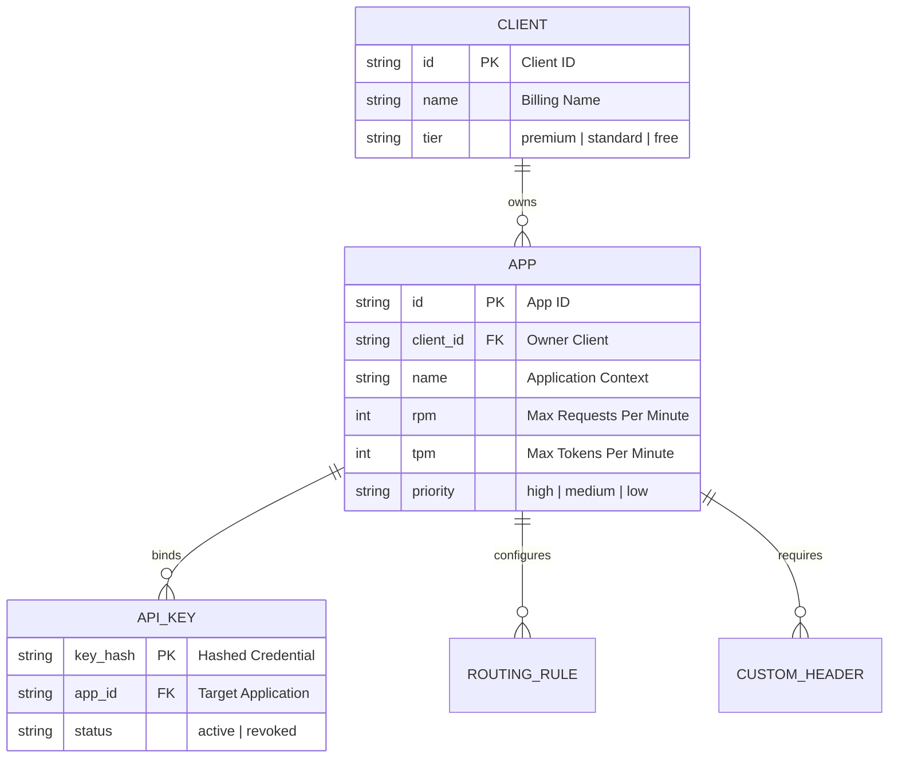
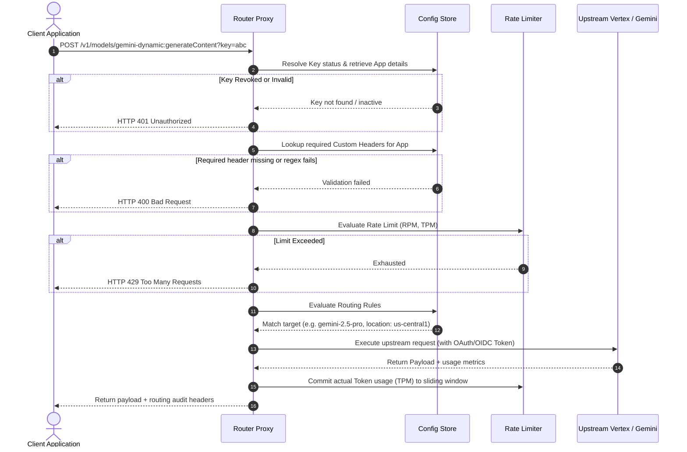

# 🗺️ System Architecture Overview

This document explains the core layers of the Smart Router: the data hierarchy, the request execution lifecycle, and the rate-limiting engine.

---

## 🗄️ 1. Data Hierarchy

The Smart Router configures limits and rules around an **App-Centric Hierarchy**:

* **Client**: Subscription tier boundary (`premium`, `standard`, `free`).
* **App**: Functional context boundary. **RPM, TPM, and latency priority are configured at the App level.** This prevents traffic spikes in one app from impacting other apps owned by the same Client.
* **API Key / Service Account OIDC**: Credentials bound to a single App.

---

## 🔄 2. Request Execution Lifecycle

Requests execute through the following pipeline:

### Pipeline Steps
1. **Credential Verification**: Hashes the API key or extracts the OIDC token to resolve the linked App and Client from the database (Firestore or `/data/local_db.json`).
2. **Custom Header Enforcement**: Loads and validates `CustomHeader` requirements (presence, regex, or enum).
3. **Rate Limit Evaluation**: Checks sliding-window limits for Requests Per Minute (RPM) and estimated Tokens Per Minute (TPM).
4. **Upstream Route Resolution**: Resolves `RoutingRule` configurations and translates model names to specific regional endpoints.
5. **Request Dispatch**: Injects GCP Service Account credentials and forwards the request upstream.
6. **Metrics Update**: Updates the sliding window with actual token usage and injects auditing response headers (`X-Routed-Model`, `X-Client-Tier`, `X-App-ID`).

---

## ⏳ 3. Token-Weight Rate Limiting (RPM & TPM)

Rate limiting is computed dynamically in-memory per App:
* **RPM**: Enforced per-second using a token bucket based on the configured RPM capacity.
* **TPM (Tokens Per Minute)**:
  * **Estimation**: Pre-request token weight is estimated efficiently on the hot path using a character heuristic (1 token ≈ 4 characters of request body).
  * **Commit / Correction**: Once the upstream request completes, the proxy intercepts the response, parses the exact `totalTokenCount` from the `usageMetadata` block, and dynamically corrects the limiter budget (refunding over-estimations or deducting under-estimations). Bypassed for streaming responses to avoid unmarshalling delay.
  * **Opt Out**: Applications can choose to completely opt out of TPM rate limits via the dashboard, relying entirely on standard RPM limiting.
* **Priority Buffering**: During transient rate limit spikes, High priority apps wait/queue up to **5s** and Medium priority apps wait up to **2s** for token availability; Low priority apps fail immediately.

---

## 🌐 4. Decoupled Services

The Smart Router is split into frontend and backend services:

* **Backend Service (`/backend`)**: Implements the API proxy, admin REST API (`/api/*`), Firestore listeners, and cache layers.
* **Frontend Service (`/frontend`)**: Renders the dashboard UI, manages session cookies via Firebase Authentication, and uses the REST API to communicate with the backend. In production, calls are secured via GCP Service Account OIDC tokens.
