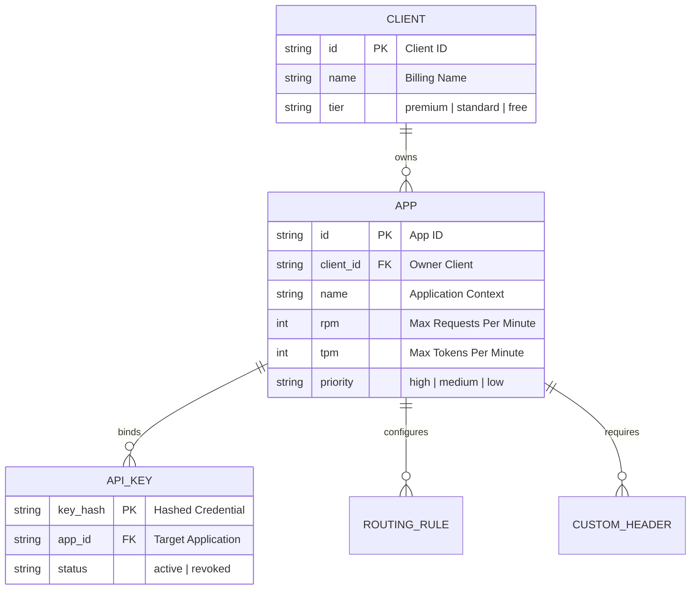
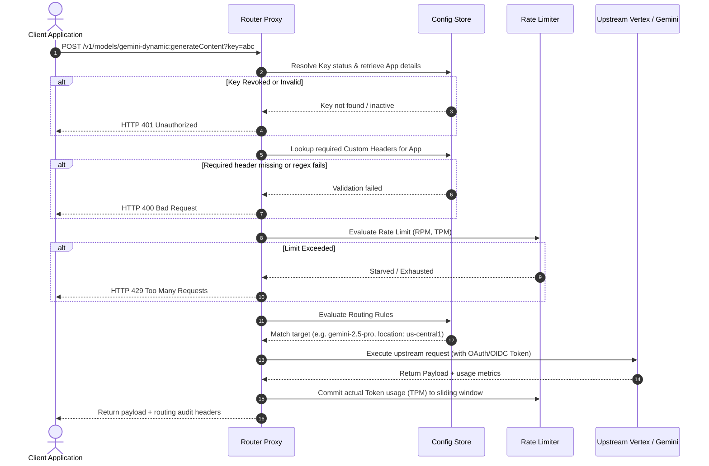
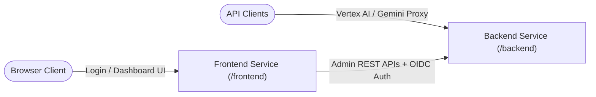

# 🗺️ System Architecture Overview

This document maps out the core architectural layers of the Smart Router: the App-Centric data model, the request execution lifecycle, and the sliding-window rate-limiting engine.

---

## 🗄️ 1. The App-Centric Data Hierarchy

The Smart Router models traffic, rate limits, and billing constraints around an **App-Centric Hierarchy** rather than binding configurations to a raw client or key:

### Core Boundaries
* **Client**: Represents the billing and subscription boundary (e.g. `premium`, `standard`, `free`).
* **App**: Represents the functional boundary (e.g. `mobile-chat`, `invoice-processing`). **RPM, TPM, and latency priority are mapped directly to the App level.** This ensures one runaway app context cannot starve another context owned by the same Client.
* **API Key / Service Account OIDC**: Access credentials bound strictly to a single App.

---

## 🔄 2. Request Execution Lifecycle

Every incoming HTTP request targeting standard Gemini or Vertex AI APIs executes through a sequential pipeline before hitting Google's upstream servers:

### Request Processing Pipeline Steps
1. **Credential Verification (`proxy.go`)**:
   - Hashes the query param key (`?key=...`) or extracts the Google OIDC bearer token.
   - Queries the active database store (Firestore or `/data/local_db.json`) to resolve the linked **App** and **Client**.
2. **Custom Header Enforcement**:
   - Loads all declarative `CustomHeader` definitions mapped to the resolved `App`.
   - Verifies matching rules (non-empty, regex, enum constraints).
3. **Rate Limit Evaluation (`limiter.go`)**:
   - Evaluates the App's sliding-window budget for Requests Per Minute (RPM) and estimated Tokens Per Minute (TPM).
4. **Upstream Route Resolution**:
   - Evaluates registered `RoutingRule` models sequentially.
   - Translates request targets (such as mapping `gemini-dynamic` or standard targets to specific regional upstream Vertex endpoints like `us-central1`).
5. **Request Dispatch & Upstream Auth**:
   - Strips local credentials and injects GCP Service Account credentials (OAuth2/OIDC token).
   - Relays request to the upstream Vertex AI or Gemini API gateway.
6. **Token Update & Auditing**:
   - Inspects upstream responses to extract token counts and updates the App's rate limit window.
   - Injects audit response headers (`X-Routed-Model`, `X-Client-Tier`, `X-App-ID`) to enable client transparency.

---

## ⏳ 3. Sliding-Window Rate Limiting

Rate limiting tracks usage per **App** in-memory. The engine uses a precise **Sliding Window Algorithm** backed by a background cleaner to purge expired entries:

### Sliding Window Mechanics
* **Requests Per Minute (RPM)**: Each request appends an in-memory timestamp to a slice of timestamps mapped to the App ID. The slice is filtered dynamically, keeping only timestamps within the last 60 seconds. If `len(timestamps) > limit.RPM`, the request is rejected with `429`.
* **Tokens Per Minute (TPM)**:
  - **Pre-Request Estimation**: Before dispatching, the proxy estimates token consumption based on request character length (`estimateTokensAndCost`). If this estimation would breach the remaining TPM budget, the request is deferred or rejected.
  - **Post-Request Commit**: Once the upstream response is received, the actual token consumption (returned in response metadata) is committed to the sliding window, overwriting the estimation.

### Garbage Collection
To prevent memory leaks, a background scheduler executes continuously in `scheduler.go`, sweeping inactive app sliding windows and releasing memory.

---

## 🌐 4. Decoupled Services Layout

The Smart Router is deployed as two separate, decoupled service components to achieve optimal isolation, security, and horizontal scaling:

### Decoupled Components

* **Backend Service (`/backend`)**:
  - Core Proxy handler representing the Vertex AI / Gemini routing engine.
  - Exposes a fully API-callable, authenticated administration REST API (`/api/*`) for configuration CRUD and model discovery.
  - Maintains the `ConfigStore` Firestore listeners and active cache layers.
* **Frontend Service (`/frontend`)**:
  - Serves all HTML Templ templates and dashboard pages.
  - Manages browser session cookies and user logins via Firebase Authentication.
  - Employs the REST-based `APIConfigStore` client to interact with the Backend Service's REST API.
  - Securely authenticates requests against the Backend API using **Google OIDC Service Account identity tokens** in production, or a local shared secret in development.

