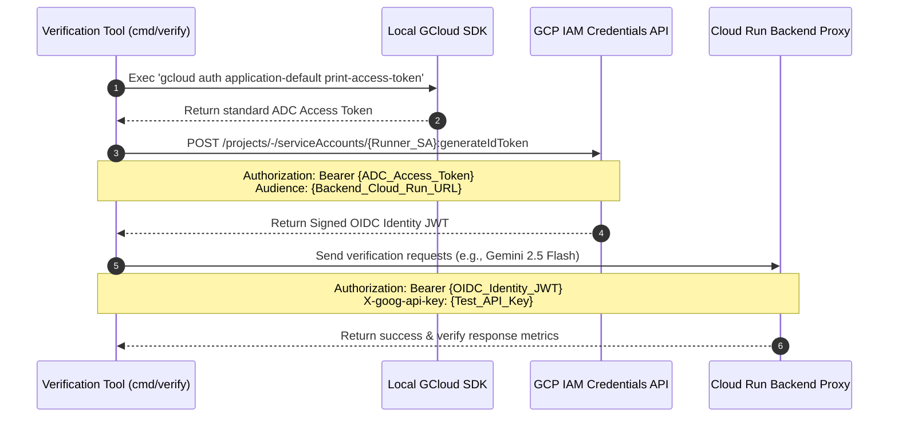

# 🚀 Cloud Run Deployment Guide

The Smart Router runs on **Google Cloud Run**. Deployment is automated using `deploy.sh` and Terraform.

---

## 📋 Google Cloud Project Prerequisites

If deploying to a new Google Cloud project:

1. **Enable Billing**: Link your project to an active Billing Account.
2. **Configure OAuth Consent Screen**: Go to **APIs & Services > OAuth consent screen**, select user type, and fill out the required fields.
3. **Enable Google Sign-In**: Go to **Identity Platform > Providers**, add **Google** as a provider, and enable it.

---

## 🔐 Step 1: Google Cloud CLI Authentication

Authenticate and configure the CLI project context:

```bash
gcloud auth login
gcloud config set project your-gcp-project-id
gcloud auth application-default login
gcloud auth application-default set-quota-project your-gcp-project-id
```

---

## 🔑 Step 2: Prepare the Environment File (`.env`)

1. Copy the sample environment template to `.env` if you haven't already:
   ```bash
   cp .env.sample .env
   ```

2. Open `.env` and configure the variables:
   * **Required User-Provided Variable**: Ensure `GOOGLE_CLOUD_PROJECT` is set to your GCP project ID.
   * **Firebase Web SDK Configurations**: **Leave them as the default placeholders!** During the deployment, `deploy.sh` will programmatically register your application with Firebase and automatically write the resolved credentials back to this `.env` file.
   * **Authorized Emails & Domains (Mandatory)**: Set `ALLOWED_EMAIL_DOMAINS` to configure dashboard admin logins (e.g., your domain or specific email address). There are no default authorized domains:
     ```ini
     ALLOWED_EMAIL_DOMAINS="mycompany.com,operator@gmail.com"
     ```

---

## 🚀 Step 3: Run the Deployment

Run the deployment script:

```bash
chmod +x deploy.sh
./deploy.sh
```

---

## 🔍 Deployment Steps Executed by `deploy.sh`

1. **Environment Checks**: Validates `.env` file variables.
2. **Firebase Provisioning**: Programmatically checks, links Firebase if necessary, registers the Web App, and updates `.env` with client SDK details.
3. **Infrastructure Setup (Terraform)**:
   * Enables APIs (Cloud Run, Firestore, Secret Manager, Cloud Build, Identity Toolkit).
   * Provisions Firestore in Native mode.
   * Configures IAM Roles.
4. **Upstream Authentication Setup**: Governed dynamically by Google Cloud Application Default Credentials (ADC), meaning no manual API keys are stored or uploaded to Secret Manager.
5. **Compilation & Deployment**:
   * Compiles HTML templates with `templ`.
   * Triggers Cloud Build to deploy Backend and Frontend services to Cloud Run.
6. **Verification Tests**:
   * Runs `go run cmd/verify/main.go` against the backend to test functionality (requests routing, security boundary, and rules engine).
   * Cleans up test records from Firestore.

---

## 🛡️ Post-Deployment Secure Verification & Token Impersonation

To maintain maximum security, the Smart Router backend on Cloud Run is deployed without public (`allUsers`) invoker permissions. Standard requests require OIDC identity token authentication matching the targeted audience (the backend service URL).

Since standard user accounts (e.g., `@google.com` or `@gmail.com` accounts logged in via `gcloud`) cannot generate custom-audience OIDC tokens directly, the post-deployment verify utility (`cmd/verify/main.go`) implements a robust **ADC-Driven Service Account Impersonation** pattern.

### 🔄 Authentication & Verification Flow



### 🛠️ Running Verification Tests Manually

If you need to run the verification tests manually from your local terminal against the active Cloud Run backend service:

1. **Ensure ADC Credentials are Active**:
   ```bash
   gcloud auth application-default login
   gcloud config set project your-gcp-project-id
   ```

2. **Retrieve your Backend Service URL**:
   ```bash
   export SERVICE_URL=$(gcloud run services describe gemini-smart-router --region us-central1 --format="value(status.url)")
   ```

3. **Execute the Verification Suite**:
   ```bash
   SERVICE_URL=$SERVICE_URL GOOGLE_CLOUD_PROJECT="your-gcp-project-id" go run cmd/verify/main.go
   ```

The utility will automatically retrieve the ADC access token, generate the signed identity token, configure mock client configurations in Firestore, verify standard and rules-based routing against real Gemini endpoints, and purge the test data upon completion.

